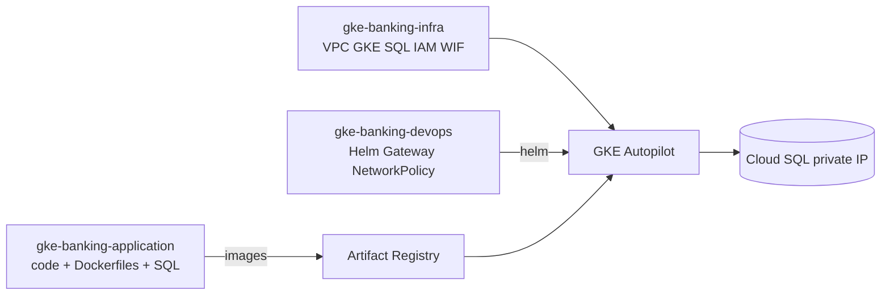
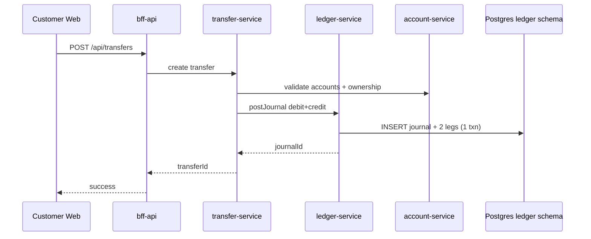
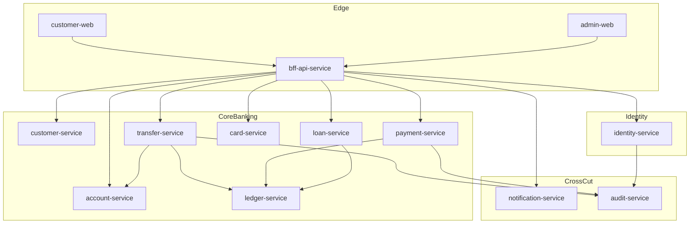

# Banking platform architecture

## 3-repo ownership (same as retail path)



Infra: [LANDING_ZONE.md](../../../banking-infra/gke-banking-infra/docs/LANDING_ZONE.md) (normal Terraform, no Fabric FAST).  
Helm: **gke-banking-devops** (next).

## Money flow (must stay correct)



**Rule:** `account.available_balance_paise` is a **cache**. Source of truth = sum of ledger legs. Transfers never `UPDATE accounts SET balance` alone.

## Domain map



## Security baseline (app layer)

1. Passwords: scrypt + salt; sessions: random token, **store SHA-256 only**
2. Helmet + CORS allowlist + rate limit on every service
3. Logs redact `authorization`, `password`, `pan`, `cvv`
4. PAN / CVV never stored — cards table keeps last4 + token id only
5. Every money mutation writes `audit.events`
6. Later (infra): private SQL via PSC, WI, NetworkPolicy, VPC-SC, no public DB
7. Ledger journals / audit events are **immutable** (DB triggers)
8. Transfers ≥ ₹1 lakh (configurable) require a **different approver**
9. Internal service calls carry `x-internal-token` when `REQUIRE_INTERNAL_AUTH=true`

## Schema layout (one DB, many schemas)

| Schema | Owns |
|--------|------|
| `identity` | users, sessions |
| `customer` | profiles, kyc_status |
| `account` | products, accounts |
| `ledger` | journals, journal_legs, accounts_balance_cache |
| `transfer` | transfers |
| `payment` | bill_payments |
| `card` | cards (tokenized) |
| `loan` | loans, schedules |
| `audit` | events (append-only) |

## Phase plan

| Phase | Deliverable |
|-------|-------------|
| **P0 (now)** | Monorepo, service-core, SQL migrations, identity + account + ledger + transfer + bff stubs |
| P1 | Real transfer posting, customer web login + accounts list |
| P2 | Cards/loans/payments UI flows |
| P3 | Infra + Helm (GCP) like retail |

## Ports (local)

```
4090 bff | 4101 identity | 4102 customer | 4103 account
4104 ledger | 4105 transfer | 4106 payment | 4107 card
4108 loan | 4109 notification | 4110 audit
5173 customer-web | 5174 admin-web
```
